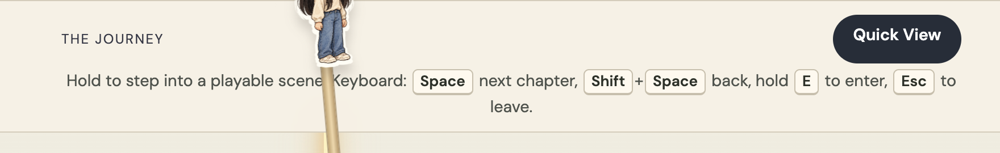
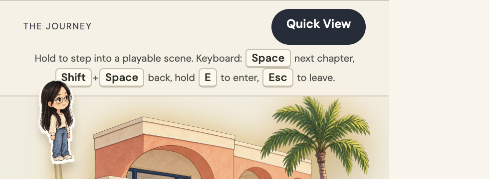
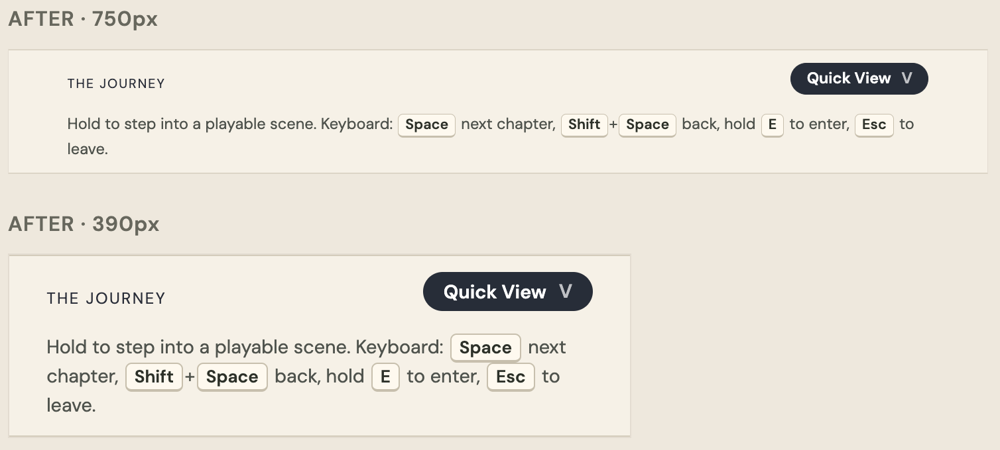

# Timeline bar

Built 2026-09-26. Sticky bar only.

## Decision

- Commands sit on the left, on the same edge as THE JOURNEY.
- 14px under the title and under Quick View.
- Quick View is a small dark chip, not a 36px button. Line-height 1.25 so the y in View is not clipped.
- V is a letter on the chip, not a keycap. A button does not hold another button. Cream keys stay on the command line. Pressing V opens Quick View, and does nothing in a text field or an open dialog.
- Command text stays 12px on phone and desktop.

The paper traveler stays. Island-card Quick View links stay.

## CSS

`.map-utility`: `align-items: flex-end`, `row-gap: 14px`.

`.hold-help`: `text-align: left`, `font-size: 12px`. Drop the phone rules that set 11px and then 10px.

`.map-quick`: no 36px min-height. `inline-flex`, `padding: 4px 12px`, `font: 600 12px/1.25`. The V has no border and no fill.

Mock: [timeline-bar-mock.html](timeline-bar-mock.html).

## Before

## After

